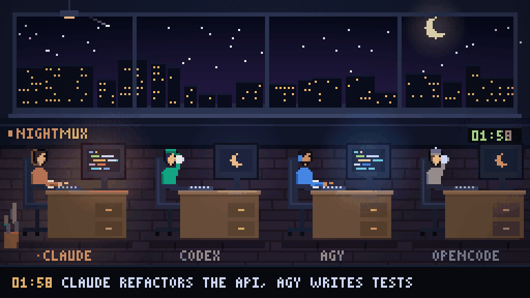

<div align="center">

# 🌙 nightmux

**Your AI coding agents keep working while you sleep.**

Drive Claude Code, Codex, Gemini, agy, opencode, Cursor, Amp, Goose and Qwen Code
from your phone. Usage limit at 2am? Your queue waits and resumes the moment the
window resets — or hands the work to another agent.

[](https://github.com/mmr710/nightmux/stargazers)
[](https://github.com/mmr710/nightmux/actions/workflows/test.yml)
[](https://pypi.org/project/nightmux/)
[](LICENSE)
[](https://github.com/mmr710/nightmux/pkgs/container/nightmux)
[](https://github.com/mmr710/nightmux/releases/latest/download/nightmux.apk)
[](pyproject.toml)
[](pyproject.toml)
[](https://t.me/+SGmmExdMHTQ3OWVk)

[Website](https://mmr710.github.io/nightmux/) · [Live demo](https://mmr710.github.io/nightmux/office.html?demo) · [Leaderboard](https://mmr710.github.io/nightmux/leaderboard.html) · [Install](#install)



</div>

## Quickstart

1. `curl -fsSL https://raw.githubusercontent.com/mmr710/nightmux/main/install.sh | sh`
2. Paste a bot token from [@BotFather](https://t.me/BotFather) — or press Enter to run dashboard-only.
3. In a topic (or **+ project** on the dashboard): `!new myproj ~/code/myproj`, then just type.

Just looking? `python3 nightmux.py --demo` and open http://127.0.0.1:8099/office — no bot, no keys.
Docker, a fresh VPS and the rest: [Install →](#install)

## How it compares

| | nightmux | hosted / relay mobile apps | tmux + SSH from a phone |
|---|:-:|:-:|:-:|
| Resumes by itself after a usage limit, or hands off to another agent | ✅ | — | — |
| Any agent CLI (Claude Code, Codex, Gemini, opencode, Cursor…) | ✅ | usually one | ✅ |
| Phone UI: menus as buttons, photos, voice notes | ✅ | ✅ | — |
| Runs on your machine; no relay sees your code | ✅ | — | ✅ |
| Overnight: schedules, `!goal` test loops, morning briefing | ✅ | — | — |
| Attaches to the tmux session you can still SSH into | ✅ | — | ✅ |
| One file, Python stdlib, no account | ✅ | — | ✅ |

## The night shift

```
02:14  ⏸ api hit the usage limit
       5-hour window spent — resumes 04:11, resuming itself with 'continue'
04:11  ▶️ api resumed · sending queued prompt
04:11  ⚙️ api
```

A usage limit at 2am used to end the night. The turn dies mid-refactor, the
prompt that started it is already spent, and the session sits there until
someone awake types `continue`. nightmux reads the reset time, holds everything
you send, and puts the work back the moment the window reopens — including the
turn the limit cut off. You read the result at breakfast.

That is the part nobody else is doing. The rest is what makes it usable:

Run **Claude Code from your phone** — or Codex, Gemini, aider, anything with a
prompt. One Telegram forum topic per project, one tmux session behind it. Text
you send is typed into that session's prompt; what the session says comes back
to the topic. Approvals arrive as tap buttons.

No container, no DNS, no certificates, no ports open, no relay service. It
attaches to tmux sessions you already have, on the machine you already use.
Python stdlib only — one file you can read.


```
   Telegram group (Topics on)          your machine
   ┌───────────────────────┐          ┌──────────────────────────┐
   │ #api      ────────────┼──────────┼─► tmux: api    → claude  │
   │ #frontend ────────────┼──────────┼─► tmux: web    → claude  │
   │ #scratch  ────────────┼──────────┼─► tmux: scratch→ claude  │
   └───────────────────────┘          └──────────────────────────┘
              ▲                                    │
              └──── output, approvals, usage ──────┘
```

## What's in the box

| | |
|---|---|
| 🌙 **Overnight** | resumes after usage limits · `!at` / `!every` schedules · `!shift` and `!plan` step queues · `!goal` loops until tests pass · morning briefing |
| 🤝 **Several agents** | Claude Code, Codex, agy, opencode, Gemini, Cursor, Amp, Goose, Qwen, aider · one topic, a bench of agents · `!failover` · `!consult` · `!pair` reviews · `!race` |
| 💸 **Tokens** | live context % and limit windows · `!cost` · `!ctx` · auto-compact · `!stats` with what to change · `!saved` · `!wrapped` card |
| 🔧 **Code** | `!git` / `!diff` / `!undo` snapshots · issues in, PRs out · CI and preview watchers · dependency health |
| 👀 **See it** | dashboard · chat PWA · pixel-art office · Android app with alerts and a widget · GIF of the night |
| 🖥 **Two servers** | one bot, several machines; move a topic between them |
| 🧩 **Yours** | one Python file, stdlib only · plugins · webhook API · runs without Telegram |

The [guide](docs/GUIDE.md) walks through each one; [COMMANDS.md](docs/COMMANDS.md) lists every command.

## Install

The fastest way to install is using the one-line installer:
```bash
curl -fsSL https://raw.githubusercontent.com/mmr710/nightmux/main/install.sh | sh
```
*(Clones — or updates — `~/nightmux` from GitHub and runs setup. Adding a
second server? Use the command its dashboard gives you instead: servers →
**+ add server**.)*

**Just looking?** `python3 nightmux.py --demo` serves the office with a made-up night — no bot, no keys.

**Docker** (tmux, Claude Code and Codex inside; your code mounted at `/code`):
```bash
docker run -it --name nightmux -v nightmux-home:/root -v ~/code:/code \
  -p 127.0.0.1:9090:9090 ghcr.io/mmr710/nightmux
docker exec -it nightmux claude      # log the agent in once
```
The dashboard has no login of its own — keep the port on `127.0.0.1` (or your tailnet).

**A fresh VPS** (Hetzner, DigitalOcean, Vultr…): paste
[`deploy/cloud-init.yaml`](deploy/cloud-init.yaml) into the provider's user-data
box, then SSH in, log the agents in and run the one-liner above.

Or from PyPI (may lag behind GitHub — the peer and dashboard features need
the current version):
```bash
pipx install nightmux
nightmux --setup
```

Or install the latest development version directly from GitHub:
```bash
pipx install git+https://github.com/mmr710/nightmux
nightmux --setup
```

or clone it, which is the version to pick if you want the source where you can
read and edit it — there are only four files and no dependencies:

```bash
git clone https://github.com/mmr710/nightmux ~/nightmux
python3 ~/nightmux/nightmux.py --setup
```

Setup walks the whole thing: BotFather token, finding your group, writing the
allowlist, wiring the Claude Code hooks, installing the service (a systemd user
unit on Linux, a launchd agent on macOS). It is idempotent — re-run it after an
upgrade.

You will be asked to create a Telegram group with **Topics** turned on and add
the bot as an **admin**. Admin is not optional: without it the bot only receives
messages addressed to it, so most of what you type never arrives.

Then, in a new topic:

```
!new api ~/code/api      # start a session and bind this topic to it
```

and type. `!help` lists the rest.

## What it feels like

```
you   fix the failing auth test
bot   ⚙️ api  · Opus 5 · 34% ctx
bot   🔧 Bash  pytest tests/test_auth.py -x
bot   🔧 Read  src/auth.py
bot   🟠 needs input api
      Bash(git commit -m "fix token expiry check")
      [ 1. Yes ] [ 2. Yes, don't ask again ] [ 3. No ]
you   (taps 1)
bot   ✅ api
      Token expiry used `<` instead of `<=`, so a token expiring exactly on the
      boundary was rejected. Fixed and committed; the test passes.
```

Approvals arrive the moment Claude Code asks, via its `Notification` hook —
before the terminal has finished redrawing.

## Commands

Everything is `!cmd` (the common ones also `/cmd`); anything else is typed into the
agent. `!help` in Telegram is a menu of eight sections. The ones you'll use first:

| | |
|---|---|
| `!new <name> <dir>` | start a session here with your default agent |
| `!codex` / `!agy` / `!opencode` … | add that agent to this topic, or switch to it |
| `@agy <text>` | one prompt to one agent, without switching |
| `!goal <check>` | after every turn run the check; failures go back until it passes |
| `!shift` | one prompt per line: a plan that runs overnight |
| `!at 03:00 <prompt>` | start work while you sleep |
| `!usage` / `!cost` / `!stats` | limit windows, spend, and what to change |
| `!undo` | roll back the agent's last turn |
| `!wrapped` | a card of your month: tokens, projects, when you code |

All of them: [docs/COMMANDS.md](docs/COMMANDS.md).

## Docs

- [Guide](docs/GUIDE.md): every feature, the config, how it works
- [Commands](docs/COMMANDS.md): generated from `!help`, so it is never out of date
- [Architecture](ARCHITECTURE.md) · [Security](SECURITY.md) · [Cookbook](cookbook/README.md) · [Changelog](CHANGELOG.md)
- [Contributing](CONTRIBUTING.md) · [Roadmap](ROADMAP.md)

## Requirements

Python 3.8+ (CI runs 3.8 through 3.13), tmux, a terminal coding agent, and Linux
with systemd (the service is optional — `python3 nightmux.py` in a terminal works
fine). Claude Code gets the hooks and the usage numbers; everything else runs on
the terminal scrape.

## Security

**The bot token is a shell on your machine, and `allow_users` is the only thing
between a stranger and your sessions.** Read [SECURITY.md](SECURITY.md) before
you add a second person or a second machine. It is short.

## License

MIT. Changes are in [CHANGELOG.md](CHANGELOG.md).
